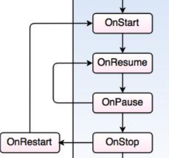

# Programming Portfolio - Second Set of Exercises

*Please complete this document to confirm the work that has been done. You will also add your answers to the provided 
questions in the space provided*

Please replace ${\color{green}-- todo}$ with ${\color{blue}-- completed}$ once done.\
\
Include an appropriate screenshot from your application to confirm completion. Screenshots should be added to 
the /images folder in the top-level repo.\
\
Include the provided question for your exercise and your answer in the space provided.

---

### Cupcake ###

|   **First Part ${\color{green}-- todo}$**   |   **Extension ${\color{green}-- todo}$**    |
|:-------------------------------------------:|:-------------------------------------------:|
|  |  |

#### Question ####
> In the CupCake example, an Intent object is used as the final part of the User Sequence. Start this 
> question by explaining what an Android Intent is.
> 
> Then with reference to the API documentation
> 
> https://developer.android.com/reference/android/content/Intent#public-constructors
> 
> Why might a developer create an instance of an Intent object with each 
> of the following 3 constructors.
> 
> Intent(Context packageContext, Class&lt;?&gt; cls) 
> 
> Intent(String action) 
> 
> Intent(String action, Uri uri) 
> 

#### Answer ####
> *Please provide your answer in this space*
> 
> 
> 
> 

---
### DiceRoller ###

|    **First Part ${\color{green}-- todo}$**     |     **Extension ${\color{green}-- todo}$**     |
|:----------------------------------------------:|:----------------------------------------------:|
|  |  |

#### Question ####
> Describe the difference between remember and rememberSaveable. Please make sure to use 
> language appropriate for Android and refer to composables, lifecycle and recomposition
> 
> https://developer.android.com/jetpack/compose/mental-model#recomposition 
> 
> https://developer.android.com/jetpack/compose/state 
>  

#### Answer ####
> *Please provide your answer in this space*
> 
> 
> 
> 

---

### DessertClicker ###

|      **First Part ${\color{green}-- todo}$**       |       **Extension ${\color{green}-- todo}$**       |
|:--------------------------------------------------:|:--------------------------------------------------:|
|  |  |

#### Question ####
> The first part of dessert clicker introduced the callbacks for the Android lifecycle.
> 
> With reference to each one shown in the following diagram provide an example from your own interactions with
> mobile applications on how you think this lifecycle call might be utilised. Note the examples you provide
> do not have to be the same app, but just an example of how a particular application might utilise a call back 
> to optimise, either the user experience or app performance.
> 
> 
> 

#### Answer ####
> *Please provide your answer in this space*
> 
> 
> 
> 

---

### MarsPhoto ###

|    **First Part ${\color{green}-- todo}$**    |    **Extension ${\color{green}-- todo}$**     |
|:---------------------------------------------:|:---------------------------------------------:|
|  |  |

#### Question ####
> In the MarsPhoto example, the MarsViewModel class has the line; 
>
>viewModelScope.launch {  
>
>} 
>
>Please expand upon what ViewModelScope is in the context of the Android 
> Lifecycle. Make sure to include how viewmodels are instantiated. 
>
>https://developer.android.com/topic/libraries/architecture/viewmodel 
>
>What is ‘launch’ in the above snippet – please explain your answer in 
> terms of Coroutines.  

#### Answer ####
> *Please provide your answer in this space*
> 
> 
> 
> 

---

